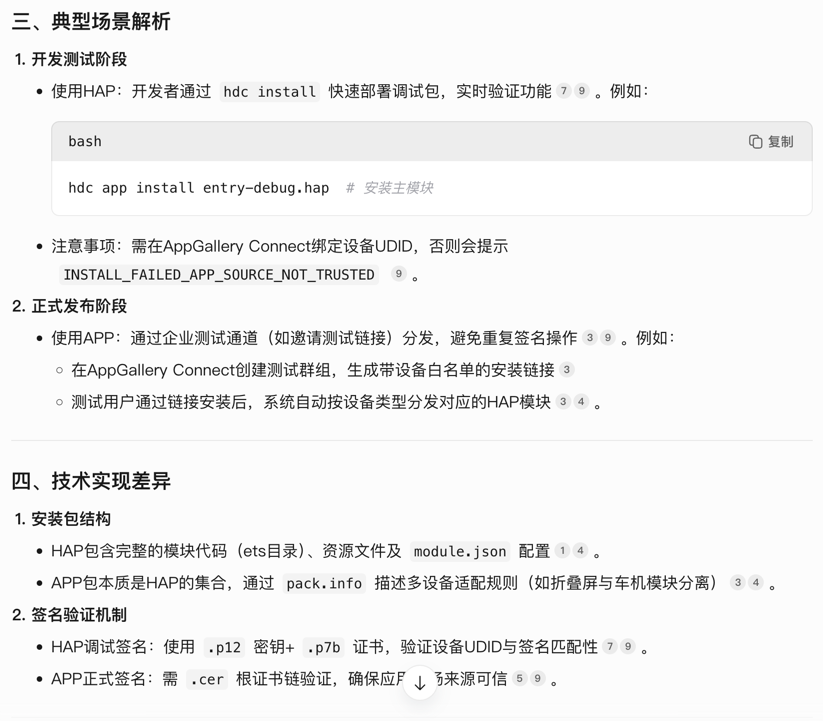

在HarmonyOS系统中，.hap和.app文件的安装方式、使用场景及底层机制存在显著差异。以下是两者的核心区别及安装特点的详细分析：
### 一、文件性质差异

**1.HAP（Harmony Ability Package）**
* **定位**：应用安装的基本单位，对应一个Module（功能模块），可直接运行于真机或模拟器
* **类型**：分为Entry（主模块）和Feature（动态特性模块），Entry是应用入口且唯一，Feature支持按需加载
**2.APP（Application Package）**
* **定位**：应用发布形态，包含多个HAP及描述文件（pack.info），用于应用市场上架
* **优化特性**：APP包内HAP经过混淆压缩，体积更小且不含调试信息，属于正式发布版本

